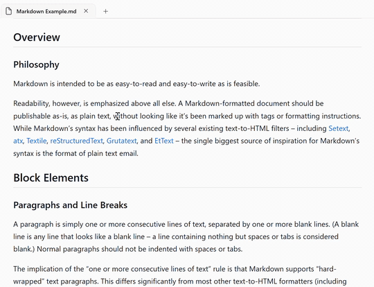

# Markdown Studio

A premium native Windows markdown editor with the editing chops of a full code editor on one side, a live preview on the other, and a few opinionated features designed to make working with markdown feel direct rather than fiddly.

It's also a great markdown **reader**. Open any folder — a documentation site, a repo full of READMEs, your library of AI prompt files — and the sidebar filters down to just the `.md` files. No source code, lockfiles, or build artifacts crowding the view; just the docs you actually came to read.

The headline feature is **X-ray edit**: a way to peek through the rendered preview and edit any block's raw markdown right where it sits.

---

## ⌧ X-ray edit



You're reading the rendered preview. You spot a typo, or want to bold a word, or fix a link. Most editors send you back to the source pane to find that line and edit it there.

In Markdown Studio, you **right-click the paragraph, heading, list, code block — even select multiple blocks** — and pick **X-ray edit**. That region of the preview transforms in place into a textarea pre-filled with the underlying markdown for exactly those source lines. The textarea inherits the preview's typography (Segoe UI Variable Text, 16px, 1.7 line-height), so a long line wraps at the same point you saw it wrap in the rendered text.

A couple of touches:

- **Caret lands where you clicked.** Right-click on a word and the cursor opens in that word. (Ctrl+E works too — it just opens the cursor at the start.)
- **Multi-block edits** combine the selected paragraphs/headings/etc. into one textarea covering the full source range, including the blank lines between them.
- **Ctrl+Enter** applies your edit back to the buffer; **Esc** cancels.
- **"Apply" — not "Save"**. The change goes into the in-memory buffer, not to disk. You still control when to `Ctrl+S`. The tab gets a dirty dot until you do.

Under the hood, X-ray uses markdown-it's source-map metadata to tag every rendered block with the source line range it came from. The preview keeps the latest markdown source in memory, so it can slice out the raw text for the textarea with no host round-trip — only the *Apply* writes back to Monaco, via a small JSON message that runs `executeEdits` over the line range.

---

## Other features

- **Markdown-only file tree.** Open any folder and the sidebar shows just the `.md`/`.markdown`/`.mdown`/`.mkd`/`.mdx` files — `.git`, `node_modules`, build output and the rest stay out of the way.
- **Rich preview** — GFM tables, task lists, footnotes, **KaTeX** math, **Mermaid** diagrams, syntax-highlighted code blocks, and editor ↔ preview scroll sync.
- **Live outline sidebar** parsed from your headings, click to jump.
- **Full-text + file-name search** across the opened folder, grouped by file.
- **Six themes** — Follow System, Daylight, Midnight, Sepia, Solarized Light, Solarized Dark — each one re-themes the editor and preview palettes together.
- **Distraction-free mode** (F11): hides everything but the editing surface.

---

## Getting started

### Prerequisites

- **Windows 10 1809+ or Windows 11**
- **.NET 10 SDK** (`dotnet --version` ≥ 10.0)
- **PowerShell 5.1+** (built into Windows) — needed for `setup-web.ps1`
- **Visual Studio 2022 17.x** with the *Windows application development* workload (optional but recommended for F5 debugging)

### Build & run

```powershell
git clone https://github.com/justinswork/MarkdownStudio.git
cd MarkdownStudio

# Downloads Monaco editor, markdown-it + plugins, KaTeX, Mermaid,
# highlight.js, github-markdown-css into MarkdownStudio/Web/ and
# generates the placeholder MSIX assets. Run once after cloning.
pwsh setup-web.ps1

# Build
dotnet build MarkdownStudio.sln -c Debug -p:Platform=x64
```

### Running from Visual Studio

Open `MarkdownStudio.sln`, set the **MarkdownStudio (Package)** launch profile, hit **F5**. Visual Studio handles the dev signing cert and MSIX deployment for you.

### Running without Visual Studio

After `dotnet build` succeeds, register the package and launch via the app's AUMID:

```powershell
$manifest = 'MarkdownStudio\bin\x64\Debug\net10.0-windows10.0.19041.0\win-x64\AppxManifest.xml'
Add-AppxPackage -Path $manifest -Register

$pkg   = Get-AppxPackage -Name 'MarkdownStudio' | Select-Object -First 1
$appId = (Get-AppxPackageManifest $pkg.PackageFullName).Package.Applications.Application.Id
Start-Process "shell:AppsFolder\$($pkg.PackageFamilyName)!$appId"
```

---

## Keyboard shortcuts

| Action | Shortcut |
|---|---|
| New file (opens in Editor mode) | `Ctrl+N` |
| Open file | `Ctrl+O` |
| Open folder | `Ctrl+Shift+O` |
| Save | `Ctrl+S` |
| Save as | `Ctrl+Shift+S` |
| Close tab | `Ctrl+W` |
| **X-ray edit (selection or hovered block)** | `Ctrl+E` |
| **X-ray apply / cancel** | `Ctrl+Enter` / `Esc` |
| Find in editor | `Ctrl+F` |
| Toggle bold / italic | `Ctrl+B` / `Ctrl+I` |
| Insert link | `Ctrl+K` |
| Toggle inline code | `` Ctrl+` `` |
| Distraction-free mode | `F11` |
| View mode: Editor / Split / Preview | (toolbar pill) |

---

## Roadmap

Things that aren't there yet but are good candidates:

- Folder watcher: pick up files added/removed from the opened folder while the app is running.
- Image paste / drag-drop into the editor.
- Git integration: file-tree decorations for modified files, simple diff view.
- Snippets and templates.
- Export to HTML / PDF.
- Custom user themes.

---

## License

TBD.
