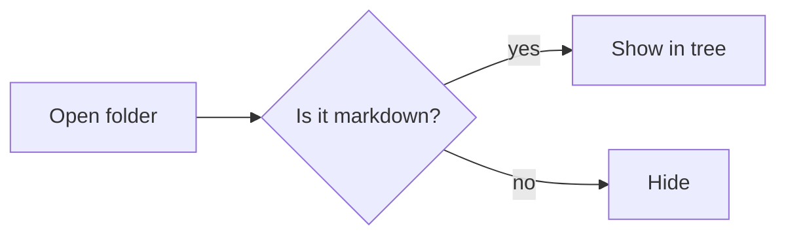

# Welcome to Markdown Studio

You're looking at the **rendered preview** of this file. The same content as raw markdown lives on the other side of the split, or behind the editor pane if you've collapsed the preview from the toolbar.

> [!TIP]
> **Try X-ray edit.** Right-click any paragraph here and pick *X-ray edit*. The paragraph turns into a textarea filled with the raw markdown for those lines — change it, hit `Ctrl+Enter`, and the edit lands in the buffer.

## The two-pane idea

The left pane is a real code editor — syntax highlighting, multi-cursor, find-and-replace, all the usual keybindings. The right pane is a live preview that re-renders as you type.

Most of the time you'll type on the left and watch on the right. But when you spot a typo or want to bold a word in the rendered text, X-ray lets you fix it where you see it. No hunting through the source pane for the line you just spotted.

## What this preview can render

### Math

Inline math with KaTeX: $E = mc^2$, and display math:

$$
\sum_{k=0}^{n} \binom{n}{k} = 2^n
$$

### Syntax-highlighted code

```python
def fibonacci(n):
    """Yield the first n Fibonacci numbers."""
    a, b = 0, 1
    for _ in range(n):
        yield a
        a, b = b, a + b
```

### Mermaid diagrams



### Tables

| Feature             | Editor | Preview |
|---------------------|:------:|:-------:|
| Syntax highlighting | ✅     | —       |
| X-ray edit          | —      | ✅      |
| Scroll sync         | ✅     | ✅      |
| Theme follows app   | ✅     | ✅      |

### Task lists

- [x] Open this file
- [x] Scroll around
- [ ] Right-click a paragraph and try X-ray edit
- [ ] Open Settings (the cog at the bottom of the activity rail) and try a different theme

### Alerts

> [!NOTE]
> Settings has three tabs — **General** (theme), **Editor** (font, size, tab size), and **Preview** (font, size, line height, content width, heading style).

> [!IMPORTANT]
> Saving (`Ctrl+S`) writes to disk. X-ray's *Apply* only updates the in-memory buffer; the tab keeps a dirty-dot until you save.

> [!WARNING]
> Closing a dirty tab prompts you to save. Closing the whole app prompts per tab.

## Sensible defaults, opinionated where it counts

Open a folder of your existing notes — the file tree filters down to just the markdown files. No `.git`, no `node_modules`, no build output crowding the view. The same filtering is what makes Markdown Studio work just as well as a **reader** as it does as an editor: a documentation site, a repo full of READMEs, a library of AI prompts — open the folder and the relevant content is right there.

## A few keyboard shortcuts worth knowing

- `Ctrl+O` open a file, `Ctrl+Shift+O` open a folder
- `Ctrl+N` new file (opens in Editor mode)
- `Ctrl+S` save, `Ctrl+Shift+S` save as
- `Ctrl+W` close tab
- `Ctrl+F` find in editor
- `Ctrl+E` X-ray the hovered or selected block(s)
- `Ctrl+Enter` apply X-ray edit, `Esc` cancel
- `F11` distraction-free mode

Happy writing.
